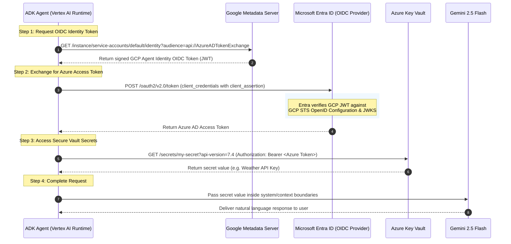

# Google Agent Identity OIDC Federation to Microsoft Entra

[](https://cloud.google.com/vertex-ai)
[](https://learn.microsoft.com/en-us/entra/)
[](LICENSE.txt)

This repository demonstrates how an agent built with the **Google Agent Development Kit (ADK)** and deployed to **Gemini Enterprise Agent Runtime** can use **Google Agent Identity** to securely authenticate across cloud providers to access Microsoft Azure resources without static credentials.

Specifically, it illustrates a cross-cloud token exchange flow:
1.  **Retrieve Identity Token:** The agent fetches its short-lived GCP Agent Identity OIDC ID Token from the Google Metadata Server. This token is cryptographically bound to the unique SPIFFE identity of the reasoning engine container.
2.  **Exchange for Azure Token:** The agent exchanges this GCP OIDC ID Token at Microsoft Entra's token endpoint (`/oauth2/v2.0/token`) for a short-lived Azure Access Token.
3.  **Access Azure Key Vault:** The agent uses the Azure Access Token to securely retrieve secret configuration data from an access-controlled Azure Key Vault.

---

## Architecture & Workflow



---

## Repository Structure

```
.
├── deploy.py               # Deploy/update the agent to Vertex AI Agent Runtime
├── requirements.txt        # Python dependencies for the agent container
├── .env.example            # Template for environment configuration
└── token_agent/
    ├── __init__.py         # Module entry point exporting `app`
    ├── agent.py            # ADK Root Agent and system prompt configuration
    ├── identity.py         # Google Metadata OIDC token retrieval helper
    └── tools/
        └── entra/
            ├── __init__.py # Exposes Entra tools
            └── entra_kv.py # Token Exchange & Key Vault retrieval tools
```

---

## Azure & Entra ID Configuration Guide

To enable Google Cloud Agent Identity to authenticate to Microsoft Entra ID via Workload Identity Federation, complete the following configuration steps in the **Microsoft Entra Admin Center**:

### Step 1: Configure Microsoft Entra ID App Registration
1. Navigate to **Identity > Applications > App registrations** and click **New registration**.
   * **Name:** `google-agent-identity-entra`
   * **Supported account types:** Single tenant (Accounts in this organizational directory only).
2. Click **Register** and note down the **Application (client) ID** and **Directory (tenant) ID**.

### Step 2: Add Federated Identity Credential in Entra ID
1. Inside your App Registration, go to **Certificates & secrets** > **Federated credentials**.
2. Click **Add credential** and choose the **Custom provider** / **Other scenario** in the dropdown.
3. Configure the credential fields exactly as follows:
   * **Issuer URL:**  
     `https://sts.googleapis.com/v1/organizations/YOUR_GCP_ORG_ID/locations/global/workloadIdentityPools/agents.global.org-YOUR_GCP_ORG_ID.system.id.goog`
   * **Subject identifier (`sub`):**  
     `principal://agents.global.org-YOUR_GCP_ORG_ID.system.id.goog/resources/aiplatform/projects/YOUR_GCP_PROJECT_ID/locations/us-central1/reasoningEngines/google-agent-identity-entra`
   * **Audience:** `api://AzureADTokenExchange`
   * **Name:** `gcp-agent-federation-credential`
4. Click **Add** to save.

> [!WARNING]
> Mappings are highly case-sensitive. The `sub` and `Issuer URL` values must match your Google Cloud variables character-for-character. Any deviation (such as a trailing slash) will result in authorization failures (`AADSTS700212`).

### Step 3: Grant Key Vault Permissions in Azure
Grant your App Registration permission to retrieve secrets from your target Key Vault:
1. Navigate to your target Key Vault in the Azure Portal.
2. Select **Access policies** (or Access control IAM if using Azure RBAC).
3. Grant the `google-agent-identity-entra` application the **Key Vault Secrets User** role or specific **Secret Get** permissions.

---

## Deployment to Vertex AI Agent Runtime

### 1. Set Up Python Virtual Environment
```bash
python3 -m venv .venv
source .venv/bin/activate
pip install -r requirements.txt
```

### 2. Set Environment Variables
Copy `.env.example` to `.env` and supply your actual IDs:
```bash
cp .env.example .env
export $(cat .env | xargs)
```

### 3. Deploy Agent
```bash
python3 deploy.py
```

---

## Usage Examples

Once deployed, the agent accepts natural language prompts to perform identity verification and secure secret retrieval:
*   "What is your Agent Identity token?"
*   "Get the value of the database-password secret from Azure Key Vault."
*   "Explain how you retrieved my secret without any passwords."

---

## License

This project is licensed under the MIT License - see the [LICENSE.txt](LICENSE.txt) file for details.
